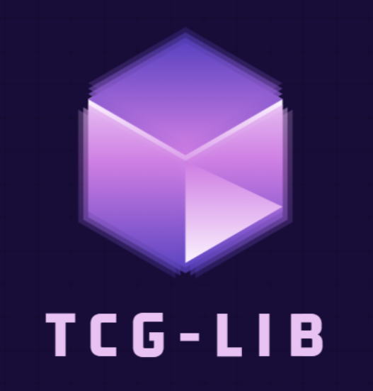
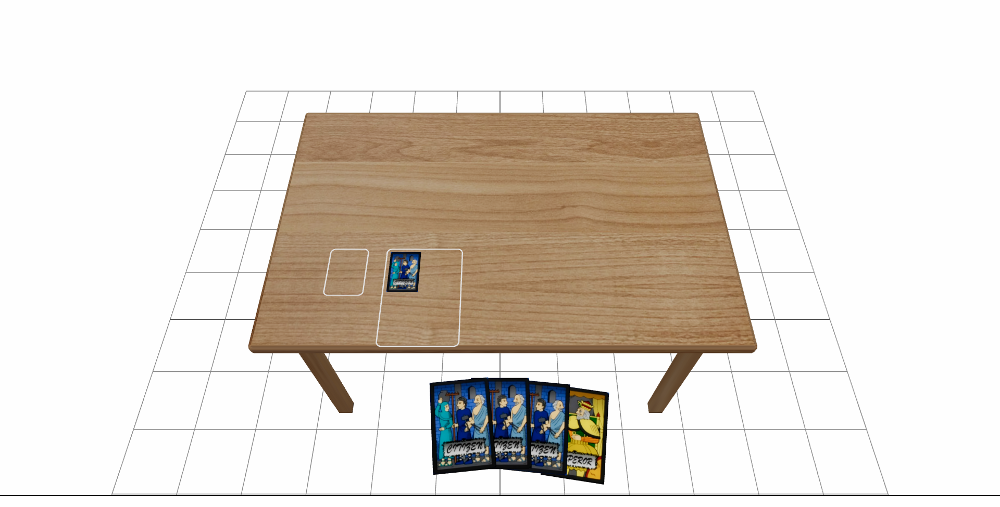

 

  

  

    TCG-Lib is a work in progress library for creating card games in the browser.
     
     
    <a href="https://github.com/Nico-Src/browser-tcg-lib/issues">Report Bug</a>
    .
    <a href="https://github.com/Nico-Src/browser-tcg-lib/issues">Request Feature</a>
  

  

    <b>Screenshot:</b>  
    
  

